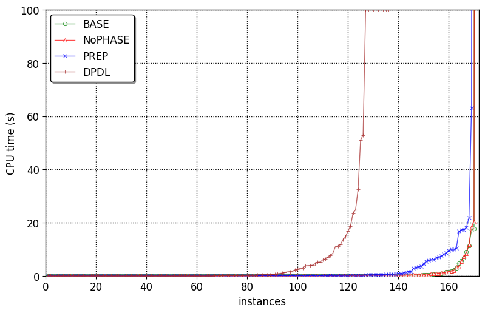

## Build + Run
To build the project, enter `make`. To run the solver on a test file, enter `./main [testfile]`. To build and run immediately, enter `make run arg=[testfile] [heur]`. To run with preprocessing `./main [testfile] [-pre]` or `make run arg=[testfile] [prepr=-pre]`. A similar approach for proof logging:  `./main [testfile] [-proof]` and  `make run arg=[testfile] [proof=-proof]`

**Examples:**

`make run arg=c1` (build and run the .exe on the first competition file )

`./main c1 -pre` (run the compiled .exe on the first competition file with preprocessing)

`./main c2 -proof` (run the compiled .exe on the first competition file with proof logging)
  
`.\run.ps1 -type 't' -start 1 -end 30 ` (run the compiled .exe on the first 30 test files)

`python runCDCL.py c 1 30` (run the compiled .exe on the first 30 comp files)

## Experimenal evaluation
Experimental Evaluation

To analyze the solver's performance, we conducted experiments and visualized the results using the images in the cactus folder. The cactus plots illustrate the solver's runtime and efficiency across different test cases.

  
   
  <em>Figure 1: Cactus Runtime Plot</em>

  
   
  <em>Figure 1: Cactus Runtime Plot</em>

**Test Environment Specifications:**
- **Hardware:**
  - Processor: AMD Ryzen 7 5700U @ 1.80 GHz
  - Memory: 16 GB
- **Software:**
  - Operating System: Windows 11 Pro
  - Compiler: GCC 11.2.0

